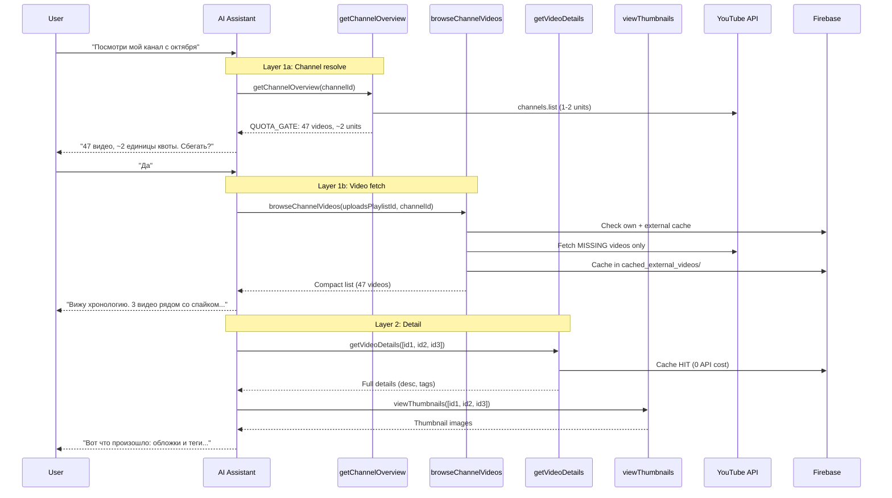

# AI Chat Tools — Architecture Overview

## Telescope Pattern

Инструменты организованы по уровням фокуса — от широкого обзора к глубокому анализу. Каждый уровень возвращает ровно столько данных, сколько нужно LLM для решения "куда копать дальше".

```
┌─────────────────────────────────────────────────────────┐
│  LAYER 1: DISCOVERY — "что существует?"                 │
│  ┌─────────────────────┐  ┌──────────────────────┐     │
│  │ getChannelOverview  │→ │ browseChannelVideos  │     │
│  │  (resolve + quota)  │  │  (fetch + cache)     │     │
│  └─────────────────────┘  └──────────────────────┘     │
├─────────────────────────────────────────────────────────┤
│  LAYER 2: DETAIL — "расскажи подробнее"                 │
│  ┌──────────────────────┐  ┌──────────────┐             │
│  │getMultipleVideoDetail│  │viewThumbnails│             │
│  │  (+ YT fallback)     │  │              │             │
│  └──────────────────────┘  └──────────────┘             │
├─────────────────────────────────────────────────────────┤
│  LAYER 3: ANALYSIS — "что здесь происходит?"            │
│  ┌────────────────────────┐  ┌────────────────────────┐ │
│  │ analyzeTrafficSources  │  │analyzeSuggestedTraffic │ │
│  │      (gateway)         │→ │     (drill-down)       │ │
│  └────────────────────────┘  └────────────────────────┘ │
├─────────────────────────────────────────────────────────┤
│  UTILITY: mentionVideo                                  │
└─────────────────────────────────────────────────────────┘
```

**Антипаттерн:** "Swiss Army Knife Tool" — один инструмент, который и обнаруживает, и фильтрует, и анализирует, и кэширует.

---

## Tool Index

| Tool | Layer | Док |
|------|-------|-----|
| [getChannelOverview](./get-channel-overview-tool.md) | 1 — Discovery | Resolve канала + quota gate |
| [browseChannelVideos](./browse-channel-videos-tool.md) | 1 — Discovery | Список видео канала + smart cache |
| [getMultipleVideoDetails](./get-multiple-video-details-tool.md) | 2 — Detail | 3-level cascade + traffic snapshot counts |
| [viewThumbnails](./view-thumbnails.md) | 2 — Detail | Visual analysis, approval gate, multi-provider |
| [analyzeTrafficSources](./analyze-traffic-sources-tool.md) | 3 — Analysis | Gateway: откуда трафик (aggregate breakdown) |
| [analyzeSuggestedTraffic](./analyze-suggested-traffic-tool.md) | 3 — Analysis | Drill-down: per-video suggested pool |
| [mentionVideo](./mention-video-tool.md) | Utility | Interactive video badges |

---

## User Flows

### Flow 1: "Посмотри мой канал"

> *"Какие видео у меня публиковались с октября по декабрь?"*

```
LLM → getChannelOverview(channelId)          // Layer 1: обзор канала (1-2 units)
  "47 видео, ~2 units квоты"
LLM → "Спросить пользователя?"
User → "Да"

LLM → browseChannelVideos(uploadsPlaylistId) // Layer 1: список видео
  "Вижу 47 видео. Пик в ноябре — 'quiet morning'.
   Хочу углубиться в 3 видео вокруг пика."

LLM → getVideoDetails([id1, id2, id3])      // Layer 2: детали (из кэша!)
  "У хита description/tags совпадают с конкурентом."

LLM → viewThumbnails([id1, id2, id3])       // Layer 2: визуал
  "Обложки почти идентичны конкуренту."

LLM → analyzeTrafficSources(id1)            // Layer 3: gateway
  "80% трафика — Suggested. Стоит копнуть пул."

LLM → analyzeSuggestedTraffic(id1)          // Layer 3: deep dive
  "В suggested pool доминируют каналы X и Y..."
```

### Flow 2: "Посмотри конкурента"

> *"Вот ссылка на канал Little Thing — посмотри, что они публикуют"*

Пользователь приносит URL → LLM вызывает `getChannelOverview` → пользователь одобряет квоту → `browseChannelVideos` → анализ.

### Flow 3: "Сравни со мной"

> *"Сравни мои последние 10 видео с последними 10 у Little Thing"*

LLM вызывает `getChannelOverview` + `browseChannelVideos` для обоих каналов → `getVideoDetails` для интересных → `viewThumbnails` для сравнения обложек.

---

## Sequence Diagram



---

## Data Layer: Video Resolution

### resolveVideosByIds (shared utility)

Все tool handlers используют единый resolver для поиска видео в Firestore:

```
functions/src/services/tools/utils/resolveVideos.ts
```

**Проблема:** Custom videos имеют document ID `custom-XXXXX`, но YouTube video ID хранится в поле `publishedVideoId`. Прямой lookup по document ID их не находит.

**Решение — 2-step resolution:**
1. **Direct lookup** — `db.getAll()` по document ID в `videos/` и `cached_external_videos/`
2. **Reverse lookup** — `where('publishedVideoId', 'in', missingIds)` для оставшихся промахов

Step 2 выполняется только если есть промахи. Для каналов без custom videos — zero overhead.

Все 6 tool handlers используют `resolveVideosByIds()` вместо прямых `db.doc()` вызовов:
- `browseChannelVideos` — batch, обе коллекции
- `getMultipleVideoDetails` — batch, обе коллекции
- `viewThumbnails` — batch, обе коллекции
- `mentionVideo` — single video, обе коллекции
- `analyzeTrafficSources` — single video, `skipExternal: true` + `docId` для подколлекций
- `analyzeSuggestedTraffic` — single video, `skipExternal: true` + `docId` для подколлекций

### Unified External Cache

**Коллекция: `cached_external_videos/`**

Единый кэш для всех видео, пришедших извне:
```typescript
{
  // ...standard video fields (title, description, tags, stats)...
  source: "suggested_traffic" | "channel_discovery" | "api_fallback";
  cachedAt: Timestamp;
}
```

**`getMultipleVideoDetails`** cascade (cheapest → most expensive):
```
videos/ (direct + publishedVideoId) → cached_external_videos/ → YouTube API
```

### Firebase Collections

| Collection | Содержимое | Источник |
|-----------|-----------|---------|
| `videos/` | Собственные видео | YouTube API (sync) |
| `cached_external_videos/` | Все внешние видео (suggested traffic + channel discovery + API fallback) | YouTube API. Поле `source` отслеживает происхождение |
| `trendChannels/{id}/videos/` | Видео конкурентов (trend sync) | YouTube API (trend sync) |

---

## Существующая инфраструктура

### Backend
- **Tool system:** `tools/definitions.ts` → `tools/executor.ts` → `tools/handlers/`
- **YouTubeService:** `getPlaylistVideos`, `getVideoDetails`, `getChannelAvatar`
- **Quota:** 10,000 units/день, нет централизованного трекинга, YouTube не имеет API для проверки остатка
