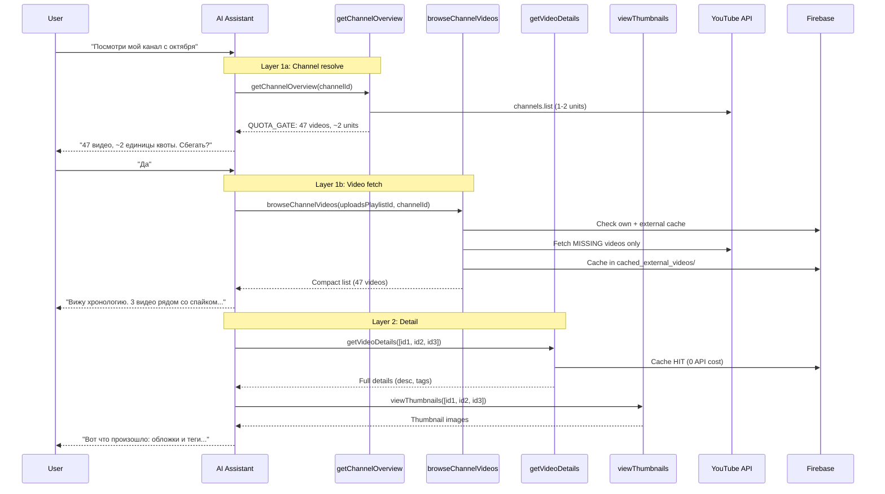

# 🔍 YouTube Research Tools — Architecture

## Зачем это нужно

Сейчас AI ассистент знает только то, что пользователь **вручную прикрепил** к чату (через context bridges). Если видео нет в приложении — ассистент слеп.

**Цель:** ассистент сам ходит на YouTube и добывает себе контекст, а за guidance возвращается к пользователю.

---

## Архитектурный паттерн: Telescope

Инструменты организованы по уровням фокуса — от широкого обзора к глубокому анализу. Каждый уровень возвращает ровно столько данных, сколько нужно LLM для решения "куда копать дальше".

```
┌─────────────────────────────────────────────────────────┐
│  LAYER 1: DISCOVERY — "что существует?"                 │
│  ┌─────────────────────┐  ┌──────────────────────┐     │
│  │ getChannelOverview  │→ │ browseChannelVideos  │     │
│  │  (resolve + quota)  │  │  (fetch + cache)     │     │
│  └─────────────────────┘  └──────────────────────┘     │
├─────────────────────────────────────────────────────────┤
│  LAYER 2: DETAIL — "расскажи подробнее"                 │
│  ┌──────────────────┐  ┌──────────────┐                 │
│  │ getVideoDetails  │  │viewThumbnails│                 │
│  │ (+ YT fallback)  │  │              │                 │
│  └──────────────────┘  └──────────────┘                 │
├─────────────────────────────────────────────────────────┤
│  LAYER 3: ANALYSIS — "что здесь происходит?"            │
│  ┌────────────────────────┐  ┌────────────────────────┐ │
│  │ analyzeTrafficSources  │  │analyzeSuggestedTraffic │ │
│  │      (gateway)         │  │                        │ │
│  └────────────────────────┘  └────────────────────────┘ │
├─────────────────────────────────────────────────────────┤
│  UTILITY: mentionVideo                                  │
└─────────────────────────────────────────────────────────┘
```

**Антипаттерн:** "Swiss Army Knife Tool" — один инструмент, который и обнаруживает, и фильтрует, и анализирует, и кэширует.

---

## User Flows

### Flow 1: "Посмотри мой канал"

> *"Какие видео у меня публиковались с октября по декабрь?"*

```
LLM → getChannelOverview(channelId)          // Layer 1: обзор канала (1-2 units)
  "47 видео, ~2 units квоты"
LLM → "Спросить пользователя?"
User → "Да"

LLM → browseChannelVideos(uploadsPlaylistId) // Layer 1: список видео
  "Вижу 47 видео. Пик в ноябре — 'quiet morning'.
   Хочу углубиться в 3 видео вокруг пика."

LLM → getVideoDetails([id1, id2, id3])      // Layer 2: детали (из кэша!)
  "У хита description/tags совпадают с конкурентом."

LLM → viewThumbnails([id1, id2, id3])       // Layer 2: визуал
  "Обложки почти идентичны конкуренту."

LLM → analyzeTrafficSources(id1)            // Layer 3: gateway
  "80% трафика — Suggested. Стоит копнуть пул."

LLM → analyzeSuggestedTraffic(id1)          // Layer 3: deep dive
  "В suggested pool доминируют каналы X и Y..."
```

### Flow 2: "Посмотри конкурента"

> *"Вот ссылка на канал Little Thing — посмотри, что они публикуют"*

Пользователь приносит URL → LLM вызывает `getChannelOverview` → пользователь одобряет квоту → `browseChannelVideos` → анализ.

### Flow 3: "Сравни со мной"

> *"Сравни мои последние 10 видео с последними 10 у Little Thing"*

LLM вызывает `getChannelOverview` + `browseChannelVideos` для обоих каналов → `getVideoDetails` для интересных → `viewThumbnails` для сравнения обложек.

---

## Инструменты

### 1. `getChannelOverview` (Layer 1 — resolve)

**Единственная задача:** разрешить канал и показать метаданные + quota estimate.

**Параметры:**
```typescript
{
  channelId: string;  // URL, @handle, или raw channel ID
}
```

**Возвращает:**
```
{
  _systemNote: "QUOTA_GATE: 47 videos, ~2 units. Ask user.",
  channelId, channelTitle, handle, videoCount, subscriberCount,
  uploadsPlaylistId,  // ← нужен для browseChannelVideos
  quotaCost, quotaUsed
}
```

**Стоимость:** 1-2 API units (всегда безопасно). `_systemNote` с QUOTA_GATE указывает LLM спросить пользователя.

---

### 2. `browseChannelVideos` (Layer 1 — fetch)

**Единственная задача:** получить список видео канала.

**Параметры:**
```typescript
{
  uploadsPlaylistId: string;  // required — из getChannelOverview
  channelId?: string;         // optional — для trend cache optimization
  publishedAfter?: string;    // ISO date — фильтр по дате
}
```

**Возвращает:**
```
{ videos: [{ videoId, title, publishedAt, viewCount, thumbnailUrl }],
  totalVideosOnYouTube, alreadyCached, fetchedFromYouTube, quotaUsed,
  ownChannelSync?: { inApp, onYouTube, notInApp } }
```
Side effect: full data cached in `cached_external_videos/`.

**Own channel comparison:** если видео найдены в `videos/` (свой канал), ответ включает `ownChannelSync` — сколько видео в приложении vs на YouTube.

**2-level smart caching:**
1. `videos/` + `cached_external_videos/` — parallel batch reads
2. YouTube API — только для truly missing videoIds

**Фильтрация по дате:**
- `publishedAfter` → отсекает старые видео (экономия на output, не на API)
- Для каналов <100 видео → загружаем всё за ~2 unit'а
- LLM заполняет `publishedAfter` из контекста разговора

---

### 3. `getMultipleVideoDetails` (Layer 2)

**3-level cascade:**
```
videos/ → cached_external_videos/ → YouTube API (1 unit/50 videos)
```

- YouTube fallback **без отдельного quota gate** (micro-cost: 1 unit на 50 видео)
- `quotaUsed: N` в ответе → **отображается в Tool pill** для пользователя
- После YouTube fetch → кэширует в `cached_external_videos/`

---

### 4. `viewThumbnails` (Layer 2)

LLM вызывает когда хочет визуально посмотреть обложки.

---

### 5. `analyzeSuggestedTraffic` (Layer 3)

Анализ suggested traffic pool (trajectory, pool transitions, tag overlap).

### 6. `analyzeTrafficSources` (Layer 3 — gateway)

> **Два разных CSV — не путать:**
>
> | | Traffic Sources (этот tool) | Suggested Traffic (tool #5) |
> |---|---|---|
> | Firestore doc | `trafficSource/main` | `traffic/main` |
> | CSV rows | ~6-8 source names (Suggested, Browse, Search…) | 50-500 individual video IDs |
> | Parser | `trafficSourceCsvParser.ts` | `csvParser.ts` |

**Роль:** gateway к cross-video analysis. Показывает откуда приходит трафик → LLM решает, стоит ли лезть глубже в `analyzeSuggestedTraffic`.

**Параметры:**
```typescript
{
  videoId: string;  // видео для анализа источников трафика
}
```

**Возвращает:** source breakdown (Browse, Suggested, Search, External) + timeline + pre-computed deltas.

**Данные:** читает CSV snapshots из Cloud Storage (тот же источник, что Traffic tab в UI). Traffic data загружается on-demand через tool call, а не заранее в context window.

---

### 7. `mentionVideo` (Utility)

Reference видео в тексте → interactive badge.

---

## Data Layer: Unified External Cache

**Новая коллекция: `cached_external_videos/`**

Единый кэш для всех видео, пришедших извне:
```typescript
{
  // ...standard video fields (title, description, tags, stats)...
  source: "suggested_traffic" | "channel_discovery";
  cachedAt: Timestamp;
}
```

**`getMultipleVideoDetails`** ищет в двух коллекциях + YouTube API fallback:
```
videos/ → cached_external_videos/ → YouTube API
```

> **Миграция `cached_suggested_traffic_videos/` завершена.**
> 10,110 документов мигрированы в `cached_external_videos/` с `source: "suggested_traffic"` + `migratedAt`.
> Все handlers, frontend сервисы и хуки переведены на единую коллекцию.
> Подробности: `docs/features/cache-consolidation-plan.md`

---

## Sequence Diagram



---

## Существующая инфраструктура

### Backend
- **Tool system:** `tools/definitions.ts` → `tools/executor.ts` → `tools/handlers/`
- **YouTubeService:** `getPlaylistVideos`, `getVideoDetails`, `getChannelAvatar`
- **Quota:** 10,000 units/день, нет централизованного трекинга, YouTube не имеет API для проверки остатка

### Firebase Collections
| Collection | Содержимое | Источник |
|-----------|-----------|---------|
| `videos/` | Собственные видео | YouTube API (sync) |
| `cached_external_videos/` | Все внешние видео (suggested traffic + channel discovery + API fallback) | YouTube API (repair, discovery, fallback). Поле `source` отслеживает происхождение: `"suggested_traffic"`, `"channel_discovery"`, `"api_fallback"` |
| `trendChannels/{id}/videos/` | Видео конкурентов (trend sync) | YouTube API (trend sync) |

---

## Backlog

### `publishedAfter` early stop при пагинации

`publishedAfter` фильтр применяется post-fetch (после загрузки всех страниц из YouTube API). Для каналов с <200 видео (1-4 страницы) это не проблема. Для каналов с 1000+ видео — тратит лишнюю квоту.

**Задача:** передать `publishedAfter` в `YouTubeService.getPlaylistVideos()` и остановить пагинацию, когда `publishedAt` видео становится старше порога. YouTube API возвращает видео в обратном хронологическом порядке — early stop безопасен.

**Затронутые файлы:**
- `functions/src/services/youtube.ts` — `getPlaylistVideos()`: добавить параметр + early stop логику
- `functions/src/services/tools/handlers/browseChannelVideos.ts` — передать `publishedAfter` в сервис

### `lookupTrendVideos` — explicit tool для trend cache

После cache consolidation tool handlers не знают про `trendChannels/`. Но trend sync бесплатно скачивает сотни видео конкурентов — эти данные должны быть доступны LLM как explicit capability, а не скрытый fallback.

**Задача:** новый тул `lookupTrendVideos` для явного доступа к trend cache:
- Параметры: `channelId` (required) — ID tracked конкурента
- Возвращает: список видео из `trendChannels/{channelId}/videos/`
- 0 YouTube API quota (всё из кеша)
- LLM вызывает явно, когда знает что видео от tracked конкурента

**Telescope Pattern integration:**
```
getChannelOverview → browseChannelVideos → lookupTrendVideos → getMultipleVideoDetails
```
LLM может выбрать `lookupTrendVideos` вместо `browseChannelVideos` если канал уже tracked — экономия квоты.

**Зависит от:** Cache Consolidation Phase 5

**Затронутые файлы (~6):**
- `functions/src/services/tools/handlers/lookupTrendVideos.ts` — NEW handler
- `functions/src/services/tools/definitions.ts` — tool definition
- `functions/src/services/tools/executor.ts` — handler registration
- `src/features/Chat/utils/toolCallGrouping.ts` — tool label
- `src/features/Chat/components/ToolCallSummary.tsx` — tool pill
- `docs/features/chat/tools/youtube-research-tools.md` — architecture update
