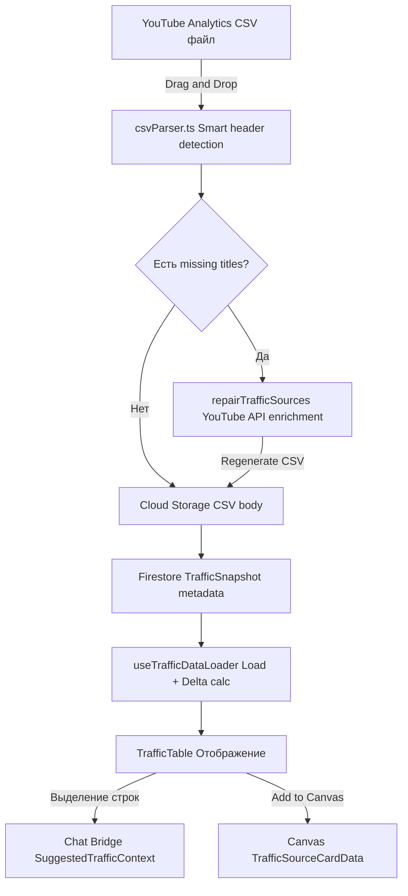

# 📊 Suggested Traffic — Feature Doc

## Текущее состояние

Таб "Suggested Traffic" внутри страницы Video Details. Показывает, **рядом с какими видео YouTube рекомендует твоё видео** (suggested / autoplay). То есть это не "что рекомендуется рядом с тобой", а "где ТЫ появляешься как рекомендация". Данные загружаются из CSV-отчёта YouTube Analytics.

**Ключевой flow:** Пользователь скачивает CSV из YouTube Analytics → загружает в приложение → парсер извлекает данные → видео обогащаются через YouTube API → данные хранятся в Cloud Storage (CSV) + Firestore (metadata) → отображаются в таблице.

**Enrichment:** Видео из CSV содержат только ID и метрики. Приложение автоматически подтягивает: title, thumbnail, channelTitle, channelId, publishedAt, duration, description, tags, viewCount, likeCount, subscriberCount через YouTube API. Кэшируются на уровне канала.

**Smart Assistant:** AI-аналитика поверх данных — автоматическое определение trafficType (autoplay/click), viewerType (bouncer→core), нишевые подсказки (Harmonic Decay).

**Версионирование:** Каждый CSV-загруз создаёт snapshot, привязанный к packaging version. Delta mode показывает прирост между снапшотами.

---

## Data Flow: от CSV до чата



---

## Хранение данных

| Что | Где | Зачем |
|-----|-----|-------|
| **CSV body** (полный файл) | Cloud Storage: `storagePath` | Без лимитов размера, дёшево |
| **Snapshot metadata** | Firestore: `trafficData.snapshots[]` | Быстрые запросы, версионирование |
| **Enrichment cache** | React Query: `useSuggestedVideoLookup` | YouTube API данные, shared per channel |
| **Edge data** (trafficType, viewerType, notes, reactions) | Firestore: per-snapshot subcollections | Per-snapshot labels |
| **Niches + assignments** | Firestore: channel-level collections | Cross-snapshot video grouping |

**Firestore path:**
```
users/{uid}/channels/{channelId}/videos/{videoId}/trafficData
  ├── sources[]           — не используется (legacy)  
  ├── snapshots[]         — metadata (timestamp, version, storagePath, label)
  ├── groups[]            — niche groups (cross-version)
  └── lastUpdated
```

---

## CSV Parsing Pipeline

1. **Drag & Drop** → `TrafficTab` получает File
2. **`csvParser.ts`** → Smart header detection:
   - Читает первую строку, матчит заголовки по словарю (`KNOWN_HEADER_NAMES`)
   - Поддерживает: EN/RU колонки, разные форматы CTR, Total Row detection
   - Если не удалось → открывает Column Mapper modal
3. **Pre-upload enrichment:**
   - Патчит missing titles из кэша (`allVideos`) — без API вызовов
   - Если всё ещё есть missing → модал: "Sync data?" → `repairTrafficSources()` → YouTube API batch
4. **CSV Regeneration** → если данные были patched, генерируется **новый** CSV с актуальными данными
5. **Upload** → CSV → Cloud Storage, metadata → Firestore `snapshots[]`

---

## Enrichment: какие данные откуда

| Поле | Источник CSV | YouTube API enrichment | Smart Assistant |
|------|:-----------:|:---------------------:|:---------------:|
| videoId | ✅ (из `YT_RELATED.xxx`) | — | — |
| sourceTitle | ✅ (может быть пустым) | ✅ `title` | — |
| impressions, ctr, views, avgViewDuration, watchTimeHours | ✅ | — | — |
| thumbnail | — | ✅ | — |
| channelTitle, channelId | Иногда | ✅ | — |
| publishedAt, duration | — | ✅ | — |
| description, tags | — | ✅ | — |
| viewCount, likeCount | — | ✅ | — |
| **subscriberCount** | — | ❌ **не запрашивается** | — |
| trafficType (autoplay/click) | — | — | ✅ |
| viewerType (bouncer→core) | — | — | ✅ |
| niche, nicheProperty | — | — | ✅ (+ manual) |

> ⚠️ **subscriberCount канала** не запрашивается при enrichment traffic sources. В Chat Bridge поле передаётся, но только если видео было enriched в другом контексте (например, через Trends). Для большинства traffic sources = `undefined`. Это gap: чтобы AI знал размер канала конкурента, нужно добавить `channels.list` запрос при enrichment (1 unit квоты на канал).

---

## Что улетает в Chat Bridge

При выделении строк → `setSlot('traffic', context)`:

**`SuggestedTrafficContext`:**
```
{
  type: 'suggested-traffic',
  snapshotId, snapshotDate, snapshotLabel,
  sourceVideo: {                          ← ТВОЁ видео
    videoId, title, description, tags,
    thumbnailUrl, viewCount, publishedAt, duration
  },
  suggestedVideos: [                      ← ВЫБРАННЫЕ строки
    {
      videoId, title,
      // CSV metrics (всегда):
      impressions, ctr, views, avgViewDuration, watchTimeHours,
      // YouTube API (если enriched):
      thumbnailUrl, channelTitle, publishedAt, duration,
      description, tags, viewCount, likeCount, subscriberCount,
      // Smart Assistant labels:
      trafficType, viewerType, niche, nicheProperty
    }
  ],
  discrepancy?: { reportTotal, tableSum, longTail }  ← Long Tail
}
```

**Вывод:** В чат улетает **всё** — CSV метрики + enrichment + labels. Это одна из причин раздутого system prompt.

---

## Что улетает в Canvas

При "Add to Canvas" → `addNodeToPage(dataArr)`:

**`TrafficSourceCardData` (per node):**
```
{
  type: 'traffic-source',
  videoId, title, thumbnailUrl,
  channelTitle, channelId, publishedAt,
  // CSV metrics:
  impressions, ctr, ctrColor, views, avgViewDuration, watchTimeHours,
  // Labels:
  trafficType, viewerType, niche, nicheColor,
  // Context:
  sourceVideoId, sourceVideoTitle,
  snapshotId, snapshotLabel, viewMode,
  // Enrichment (для chat bridge, не рендерится на canvas):
  description, tags, viewCount, duration
}
```

**Canvas ноды содержат enrichment data** (description, tags) — они не рендерятся визуально, но используются когда Canvas Bridge передаёт selection в чат.

---

## Roadmap

### Стадия 1 — CSV Import + Table ✅
- [x] Smart CSV parser с auto-detection колонок
- [x] Column Mapper fallback (manual mapping)
- [x] TrafficTable с сортировкой, фильтрами
- [x] Total Row detection + Long Tail discrepancy

### Стадия 2 — Snapshots + Versioning ✅
- [x] Hybrid storage: CSV → Cloud Storage, metadata → Firestore
- [x] Snapshot timeline привязана к packaging versions
- [x] Delta mode (прирост между снапшотами)
- [x] Packaging snapshot preservation (если version удалена)

### Стадия 3 — Enrichment ✅
- [x] Pre-upload: patch titles из кэша
- [x] Missing Titles modal + `repairTrafficSources` (YouTube API)
- [x] CSV regeneration после repair
- [x] Enrichment cache (React Query, per-channel)

### Стадия 4 — Smart Assistant ✅
- [x] Auto-detect autoplay (0 impressions + >0 views)
- [x] Viewer Type auto-classify
- [x] Niche suggestions (Harmonic Decay Scoring)
- [x] Cross-tab suggestions (Trends → Traffic niches)

### Стадия 5 — Bridges ✅
- [x] Chat Bridge: SuggestedTrafficContext + full enrichment
- [x] Canvas Bridge: TrafficSourceCardData + frame grouping
- [x] Reactions (star/like/dislike) — per-channel
- [x] Notes — per-snapshot ← YOU ARE HERE

### Стадия 6 — Lightweight Context (будущее)
Мосты передают только ID вместо полных данных. Gemini сама запрашивает details.
- [ ] Chat Bridge передаёт `{ videoId, title, impressions, views }` вместо full data
- [ ] Gemini вызывает `getVideoDetails(id)` для description, tags, thumbnail
- [ ] 500 traffic sources → 500 IDs (~3K токенов) вместо 500 full descriptions (~140K)

### 🚀 Production
- [ ] **Архитектура:** Lightweight bridge + Function Calling
- [ ] **Стоимость:** Прикрепить 500 traffic sources = ~$0.01 (IDs only) вместо ~$2.80 (full data)
- [ ] **Хранение:** CSV в Cloud Storage (без изменений) + vector embeddings для search
- [ ] **API:** YouTube Data API (enrichment при добавлении), Embedding API (для vector search)

---

## Связанные фичи
- [Chat](./chat.md) — Traffic Bridge передаёт `SuggestedTrafficContext` в чат
- [Canvas](./canvas.md) — Traffic nodes на Canvas с frame grouping
- [Video Details](./video-details.md) — Suggested Traffic живёт как таб внутри Details page

## Техническая заметка (для агента)
**Главный компонент:** `pages/Details/tabs/Traffic/TrafficTab.tsx` (1316 строк, 61KB)
**Parsing:** `utils/csvParser.ts`, `utils/csvGenerator.ts`
**Loading:** `hooks/useTrafficDataLoader.ts` (delta calc, snapshot loading)
**Enrichment:** `hooks/useMissingTitles.ts` (YouTube API repair)
**Smart Assistant:** `hooks/useSmartTrafficAutoApply.ts`, `useSmartViewerTypeAutoApply.ts`, `useSmartNicheSuggestions.ts`
**Types:** `core/types/traffic.ts` (TrafficSource, EnrichedTrafficSource, TrafficSnapshot, TrafficData)
**Storage:** Cloud Storage (CSV body via `storagePath`), Firestore (snapshot metadata)
**Bridge:** Inline in TrafficTab.tsx (lines 577-676 → chat, lines 969-1060 → canvas)
