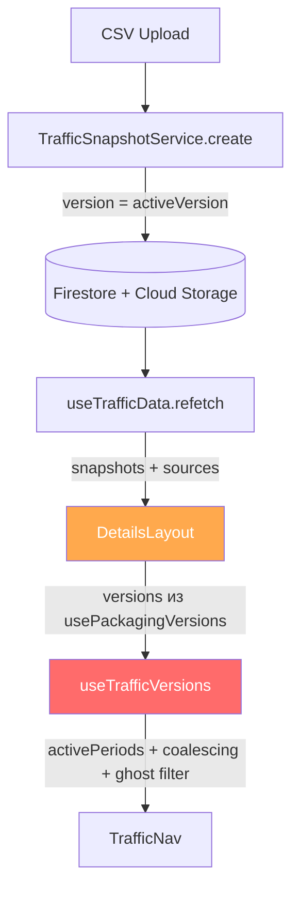
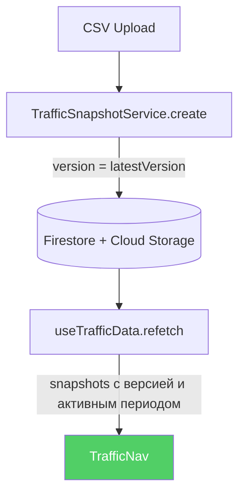

# Рефакторинг: Suggested Traffic Sidebar

> **Статус:** Аудит завершён, готов к реализации  
> **Дата:** 2026-02-27  
> **Контекст:** Баг со snapshot'ом, не появляющимся под active version, был исправлен. Аудит выявил системную переусложнённость.

---

## Проблема

Текущая архитектура **автоматически привязывает snapshot к активной packaging-версии** через систему `activePeriods`. На практике это создаёт больше проблем, чем решает:

1. **Несовпадение версий** — если packaging не обновлён вовремя, snapshot прикрепляется к неправильной версии
2. **Сложная коалесценция** — 280-строчный `useMemo` в `useTrafficVersions` анализирует «gaps» между периодами, ищет «intervening» версии, мержит/сплитит периоды
3. **Ghost filter** — скрывает версии без snapshot'ов, но некорректно определяет «active» (был баг)
4. **3 независимых алгоритма фильтрации** снэпшотов по периодам с разными буферами (0ms vs 5000ms)
5. **Зависимость от `usePackagingVersions`** — traffic sidebar тесно связан с packaging history, хотя по сути это отдельная функциональность

### Текущая архитектура

---

## Предлагаемое упрощение

### Новая модель

**Snapshot привязывается к последней packaging-версии по умолчанию.** Юзер может вручную перекрепить через dropdown (аналогично move-to-group в music playlists).

**Active period рассчитывается автоматически:**
- Первый snapshot: **дата публикации видео → дата загрузки snapshot'а**
- Каждый следующий: **дата загрузки предыдущего snapshot'а → дата загрузки текущего**
- Юзер может вручную задать/изменить период через `DateRangePicker`

### Сравнение моделей

| Аспект | Текущая | Новая |
|--------|---------|-------|
| Привязка snapshot → version | Auto по `activeVersion` на момент upload | Latest version, ручной reassign |
| Active period | Из `activePeriods` packaging version | Авто: publish→upload / upload→upload |
| Sidebar display | Coalescing + ghost filter (280 строк) | Flat list с группировкой по version |
| Зависимость от packaging | Тесная (`activePeriods`, `SYNC_FROM_PROPS`) | Минимальная (только `versionNumber`) |
| Ручное управление | Нет | Dropdown reassign + DateRangePicker |

---

## Что устраняется vs добавляется

### Удаляемая логика (~440 строк)

| Файл | Что убирается | ~Строки |
|------|--------------|---------|
| `useTrafficVersions.ts` | Coalescing, ghost filter, virtual list, global timeline | 280 |
| `usePackagingVersions.ts` | `sanitizedInitialHistory`, зависимость traffic от `navSortedVersions` | 30 |
| `DetailsLayout.tsx` | Wiring `navSortedVersions` → sidebar, snapshot auto-selection по периодам | 50 |
| `useTrafficDataLoader.ts` | Дублированные Priority 2/3 branches, period filtering | 80 |

### Добавляемая логика (~100 строк)

- Простая группировка snapshot'ов по version (~60 строк)
- Auto-calculation `activeDate` при создании (~20 строк)
- Context menu dropdown "Reassign version" (~20 строк)

### Без изменений

- `TrafficSnapshotService` (CRUD)
- `TrafficUploader` (CSV parsing)
- `SidebarSnapshotItem` (UI)
- Delta calculation

---

## Edge Cases

### 🔴 Критические

#### 1. Create Version flow
При создании новой версии модал просит сохранить snapshot текущего traffic. Этот snapshot относится к **старой** версии, но "latest version" уже будет **новой**.

**Решение:** В flow создания версии (и restore) — передавать explicit `version`, не использовать latest.

#### 2. Delete snapshot ломает цепочку периодов
Если есть A→B→C с auto-calculated периодами `[publish→A], [A→B], [B→C]`, то удаление B оставит C с `start = B.timestamp`, хотя B уже не существует.

**Решение:** При удалении snapshot — пересчитать `activeDate.start` следующего snapshot'а.

#### 3. Draft-only видео / нет packaging versions
Если `activeVersion === 'draft'` и нет numbered versions — к чему крепить?

**Решение:** Fallback на `version: 1` (как сейчас в `useTrafficData.handleCsvUpload`).

### 🟡 Средние

#### 4. Нет `publishDate` у видео
Custom (неопубликованные) видео не имеют `publishedAt`.

**Решение:** Fallback `start = timestamp` (период = одна дата).

#### 5. Reassign меняет группировку, но не период
Snapshot с периодом `[Jan 5 → Jan 12]` перекреплённый из v.2 в v.3 — период не изменится. Данные-то за тот же период.

**Решение:** Reassign не меняет `activeDate` — осознанное действие юзера. Можно показать warning, если период выходит за рамки жизни версии.

#### 6. Restore version flow
При restore модал просит snapshot, который нужно крепить к восстановленной версии, а не к latest.

**Решение:** Аналогично Create — explicit `version` в modal flow.

### 🟢 Минорные

#### 7. Rapid uploads
Несколько snapshot'ов за секунды → nearly-zero `activeDate` duration.

**Решение:** Ок для MVP, юзер может поправить даты вручную.

#### 8. Migration backfill
Старые snapshot'ы без `activeDate` нужно рассчитать ретроактивно.

**Решение:** Backfill считает `activeDate` внутри каждой version-группы отдельно (сортировка по `timestamp` внутри `version`).

---

## План миграции

1. Добавить auto-calculation `activeDate` при создании snapshot
2. Заменить `useTrafficVersions` на простую группировку
3. Добавить context menu dropdown "Reassign version" в `SidebarSnapshotItem`
4. Убрать зависимость traffic sidebar от `navSortedVersions` / `activePeriods`
5. Миграция — бэкфилл `activeDate` для существующих snapshot'ов
6. Удалить мёртвый код (coalescing, ghost filter, sanitization)

---

## UI компоненты для реализации

- **Reassign version:** dropdown как в music playlist "move to group"
- **Edit active period:** существующий `DateRangePicker.tsx`
- **Sidebar display:** существующий `SidebarSnapshotItem` + упрощённая группировка
